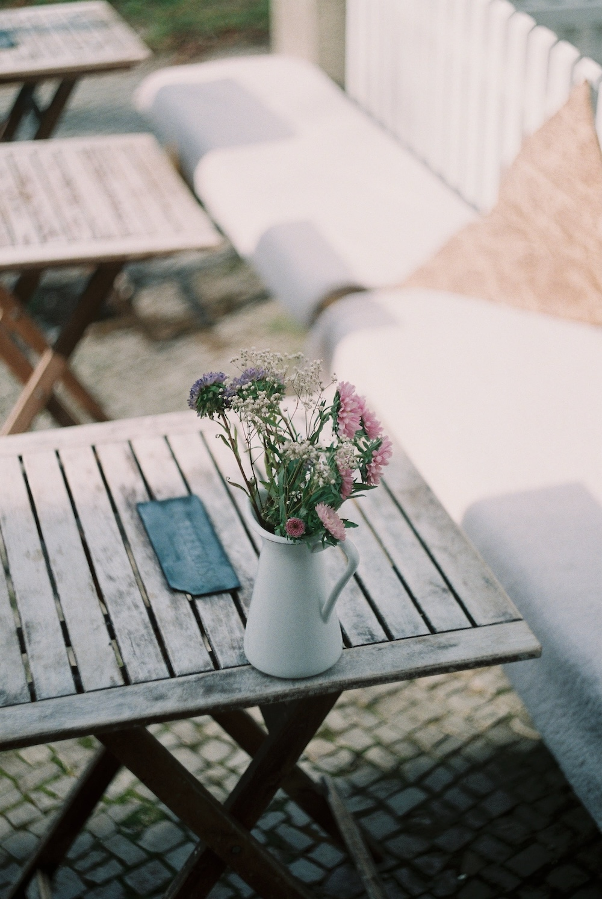

# Resizing

A cruical part for each of the hashing algorithms implemented by this crate is the resizing of the image to a lower resolution. This makes sure that we get the same results for differently images with different original dimensions.

The library supports different options on how to resize the image - aspect, fit and fill. Technically it is not reallly import which mode you choose, as long as you are consistent, however depending on the images you want to hash it might make sense to see which resizing mode yields the best results for you.

Next we will take a closer look at the different modes and what they mean. For our example we will use the following image:

## Fit

## Stretch

## Fill

